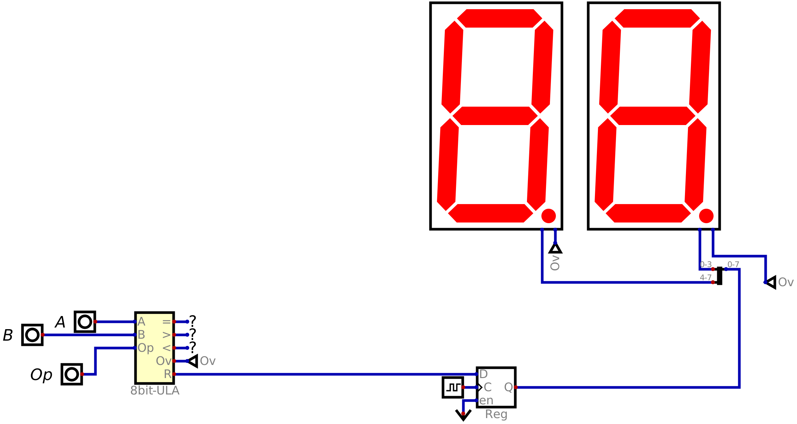

# P1 - CPU 8 bits

Nesta ponderada, criei uma CPU simplificada. Aqui, há apenas o ciclo de execução com:

- Uma ALU (Arithmetic Logical Unit) com **soma, subtração, comparação, left bit shift e multiplicação**.
- Um circuito de controle capaz de selecionar qual operação deve ser feita a partir de _opcodes_.
- Duas entradas de dados de 8 bits (A e B) e uma entrada de dados para o opcode, com 3 bits (op).
- A saída deve ser feita utilizando um registrador de 8 bits ligado a dois displays de sete segmentos.

## Especificação das operações

- A subtração deve ser feita utilizando representação por complemento de dois.
- A comparação precisa ter entrada de dois valores de 8 bits e três saídas: uma para A == B, outra para A < B e uma terceira para A > B.
- O bit shift não precisa ter seleção para esquerda ou direita, bastando fazer o deslocamento para a esquerda. Também não precisa fazer wrap around.
- A multiplicação ficará restrita a valores de 4 bits. Desta forma, não precisa armazenar resultados de 16 bits para multiplicação de 8 bits por 8 bits.

## Conteúdo

Estabelecido o desafio, utilizei o [_Digital_](https://github.com/hneemann/Digital?tab=readme-ov-file) como simulador de portas lógicas e da CPU como um todo.

### Estrutura de pastas

<pre>
cpu/
│
├── Digital/
└── media/
</pre>

Onde:

- **Digital/** -> Pasta com os circuitos (que você pode baixar e testar)
- **meida/** -> Pasta com as imagens utilizadas aqui.

### ALU

