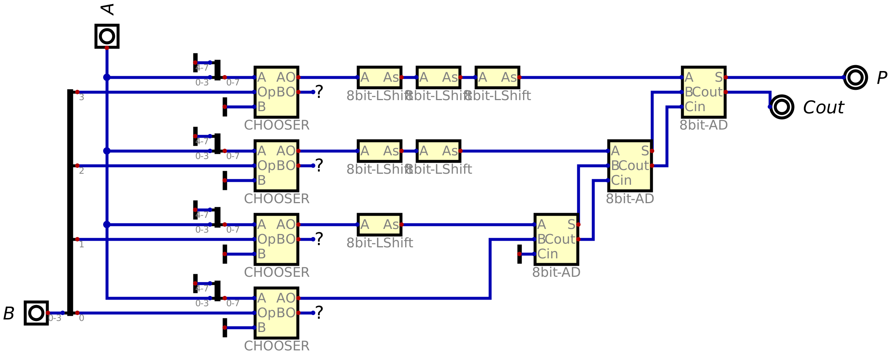

# P1 - CPU 8 bits

Nesta ponderada, criei uma CPU simplificada. Aqui, há apenas o ciclo de execução com:

- Uma ALU (Arithmetic Logical Unit) com **soma, subtração, comparação, left bit shift e multiplicação**.
- Um circuito de controle capaz de selecionar qual operação deve ser feita a partir de _opcodes_.
- Duas entradas de dados de 8 bits (A e B) e uma entrada de dados para o opcode, com 3 bits (op).
- A saída deve ser feita utilizando um registrador de 8 bits ligado a dois displays de sete segmentos.

## Especificação das operações

- A subtração deve ser feita utilizando representação por complemento de dois.
- A comparação precisa ter entrada de dois valores de 8 bits e três saídas: uma para A == B, outra para A < B e uma terceira para A > B.
- O bit shift não precisa ter seleção para esquerda ou direita, bastando fazer o deslocamento para a esquerda. Também não precisa fazer wrap around.
- A multiplicação ficará restrita a valores de 4 bits. Desta forma, não precisa armazenar resultados de 16 bits para multiplicação de 8 bits por 8 bits.

## Conteúdo

Estabelecido o desafio, utilizei o [_Digital_](https://github.com/hneemann/Digital?tab=readme-ov-file) como simulador de portas lógicas e da CPU como um todo.

### Estrutura de pastas

<pre>
cpu/
│
├── Digital/
└── media/
</pre>

Onde:

- **Digital/** -> Pasta com os circuitos (que você pode baixar e testar)
- **meida/** -> Pasta com as imagens utilizadas aqui.

### ALU

#### Soma

Para construir meu somador de 8 bits, precisei de 8 somadores de 1 bit, cada somador utilizando dois meio-somadores (_half adders_):

- _(Half Adder)_

Com dois half adders, eu consigo um adder de 1 bit, já que no adder falta apenas o Carry in corretamente inserido:

Adicionando 8 somadores em sequência, conseguimos um Full Adder de 8 bits:

#### Subtração

Para a subtração, basta utilizar um adder de 8 bits e convertendo o segundo valor com complemento de 2. Inclusive, para fazer isso, basta inverter todos os bits desse valor e adicionar um Carry in no somador, seguindo a seguinte lógica: **A - B = A + ~B + 1**, sendo ~B o inverso de B.

#### Comparação

Para construir a comparação, primeiro eu criei um comparador de 1 bit:

A lógica por trás dele é simplesmente verificar se A e B são um maior, menor ou igual ao outro, mas apenas fazer essa comparação, _se e somente se, a comparação anterior permitir._

Para comprreender o que quero dizer com a comparação anterior, vamos ver o comparador de 8 bits:

Ao longo do comparador, eu vou verificando os bits de posições iguais dos dois valores. Se eles forem iguais, o circuito pode seguir para o próximo bit, até chegar no último que, se igual, garante que os dois números são iguais. Além disso, para permitir a comparação de dois números com sinal, eu inverti as duas primeiras saídas de maior ou menor, já que um número negativo possui o dígito mais significativo maior que números positivos.

##### Left Arithmetic Shift

Como qualquer bit shift era permitido, eu utilizei o Arithmetic Shift pois ele permite o shift de um número com sinal.

##### Mutiplicador

O multiplicador basicamente uma soma com os números em left shift equivalente à sua posição em relação ao segundo valor, resultando no seguindo multiplicador de 4 bits:

